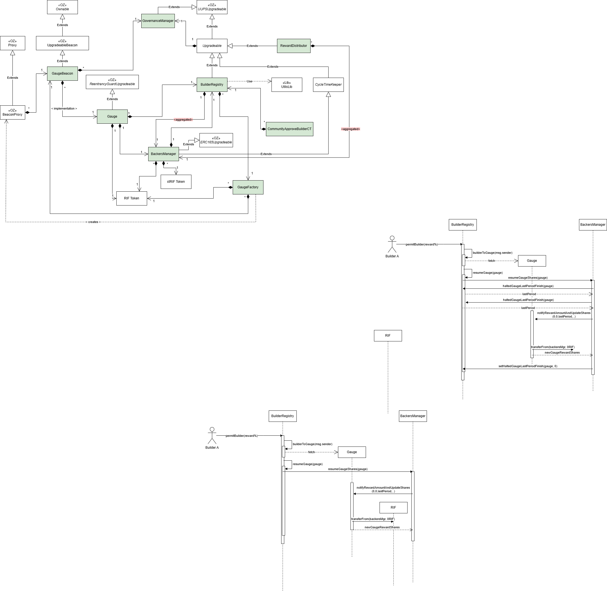

# Contracts

## Gauge

One `Gauge` is deployed for each Builder who is approved by the community. The Gauge is in charge of receiving the rewards to be distributed between the Builder and the Backers. It's also responsible for keeping track of the Backers' allocation. The Builder is always identified with a unique address and there is always one gauge associated to one Builder.

## GaugeBeacon

To create gauges for each Builder, we made use of the [Beacon proxy pattern](https://docs.openzeppelin.com/contracts/3.x/api/proxy#beacon). GaugeBeacon is the contract in charge of keeping track of the implementation.

## GaugeFactory

GaugeFactory is the contract which creates Gauge when a new Builder is approved by the community. It makes use of the GaugeBeacon to create new [BeaconProxy](https://docs.openzeppelin.com/contracts/3.x/api/proxy#BeaconProxy) contracts.

## BackersMangers

This contract is in charge of:
- allocating Backers votes to Builder gauges. Backers can allocate to one Builder or multiple Builders at the same time.
- managing the distributution of the rewards across the Builder gauges
- allow the Backers to claim all of the rewards in a single transaction.

In the initial implementation, the BackersManager was an independent contract. To reduce the gas cost and still keep responsibilities separated we decided to implement a separation of concerns through inheritance. Please have a look at the class diagram to check the inheritance chain.

## BuilderRegistry

Its main responsibility is to manage the Builders and their state. It allows to:
- approve Builders KYC
- revoke Builders KYC
- community approve Builders
- remove community approval for the Builders
- pause/unpause Builders
- store Backers reward percentage
- keep track of the Builder<->Gauge association
- allow the Builder to change the Backers reward percentage
- allow the Builder to replace the Builder reward receiver address
- get the list of gauges

## CycleTimeKeeper

It's in charge of managing the cycle and the distribution and to retrieve the related information:
- it returns the start and the end of the cycle using a specific timestamp
- it allows to change the next cycle duration and offset, so as the distribution duration

## Reward Distributor

This contract is in charge of storing funds to cover multiple cycles and to send those funds to `BackersManger` to be then re-distributed. It stores the default amounts that will be used for the next distribution. By using it, `FoundationTreasury` can:
- send the rewards using the default amount to BackersManager and start the distribution
- send the rewards to BackersManager (using amounts that are different than the default ones) and start the distribution
- send the rewards without starting the distribution
- set the default reward amounts

## GovernanceManager

Its responsibility is to manage all the roles involved in the protocol and to execute complex changes by means of an authorized changer. It exposes few functions to validate that an address is one of the managed roles and to update the addresses assigned to those roles.
- governor: the contract representing the DAO governor TODO: add link here
- authorized changer: a smart contract temporarily authorized by the Governor
- foundationTreasury: an address in charge of managing the RewardDistributor
- kycApprover: an address whose responsibility is to manage the KYC
- upgrader: ad address that is authorized (together with the governor and an authorized changer) to upgrade the contracts
